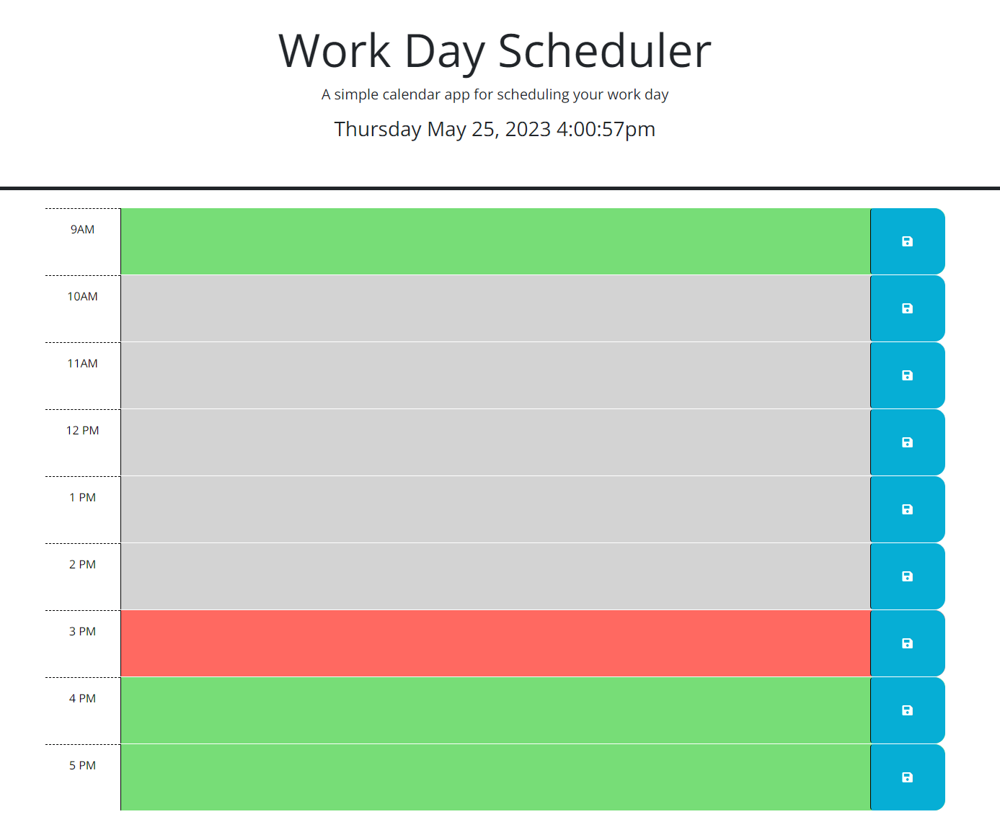

# Challenge-5-Day-Calendar

## Description
- Ever needed to organize your day? Then look no further! 
- I've created a dynamic calendar with a live clock to track what time of the day it currently is for your calendar
- For the current hour your calendar will display a red box, for the past hours your calendar will display a grey box, and for your future hours, it will display a green box
- The above allows you to keep track of what meetings or "To Do" list items have past, currently need to joined or worked on, and what you have in store for the future hours of the work day
- When you input your appointments or "To Do" list tems into the text boxes for each our, you can click the "Save" icon button to the right and it will store all of this data into local storage on your conputer through the inspect > application tab in your console

## Screenshot
- 

## Github Repo & Deploy Links
- https://github.com/iKingSpacely/challenge-5-day-calendar

- https://ikingspacely.github.io/challenge-5-day-calendar/
